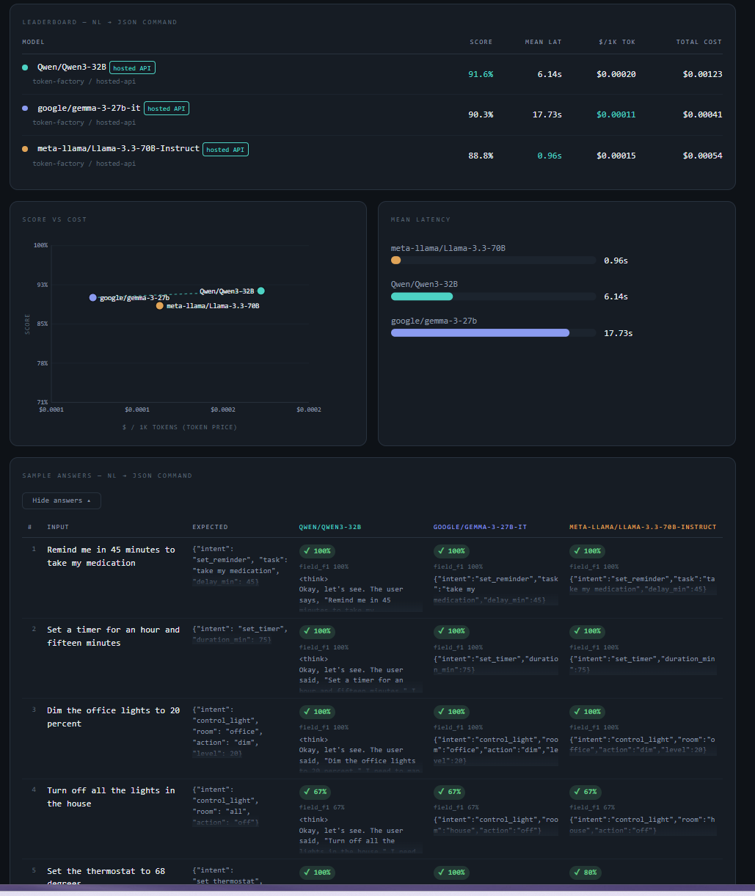
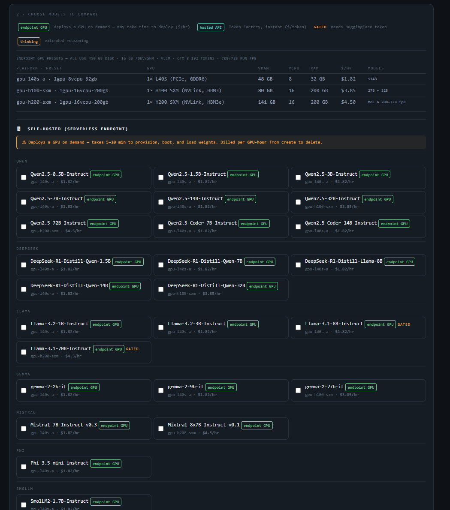
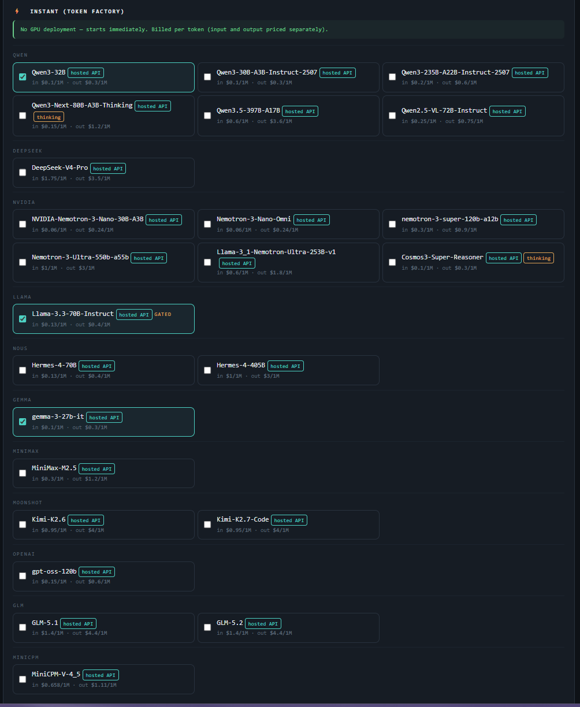
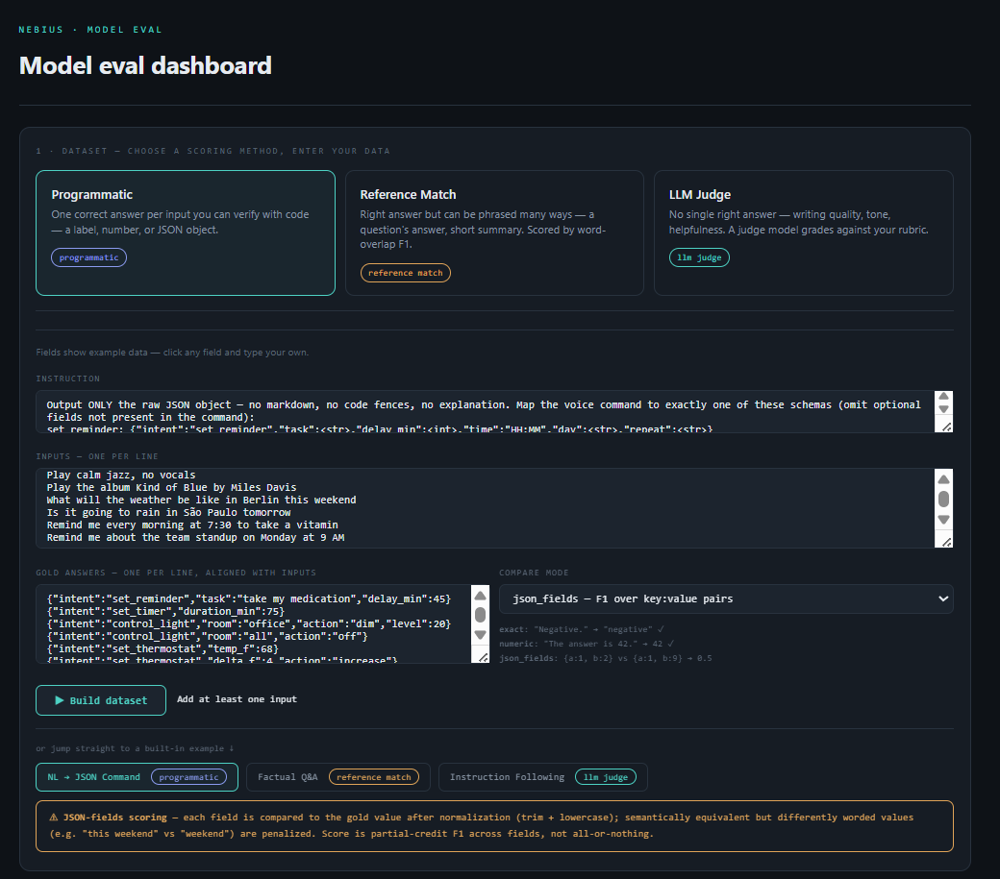

# Nebius Serverless Eval Dashboard

Compare LLMs side by side on your own tasks, running against real Nebius
infrastructure — no mocks, no simulated scores. A local dashboard lets you pick
a scoring method, enter data (or use a built-in example), choose up to 3
models, and get a leaderboard with accuracy, latency, and cost.



*Leaderboard, score-vs-cost and latency charts, and per-sample answers after
comparing three models on the NL → JSON Command task.*

## Why this exists

Public benchmark leaderboards rank models on generic tasks, and those rankings
shift constantly. But a model that sits *lower* on a public chart can easily be
the better choice for **your** data — the benchmark never saw your prompts, your
formats, or your quality bar. The only way to know which model is actually best
for your use case is to test them on your own data.

That's what this dashboard is for. Bring your own tasks, run several models
against them, and get a like-for-like comparison on the three things that
actually decide a deployment:

- **Quality** — did it get the answer right on *your* data, under *your* scorer.
- **Latency** — how fast it responds.
- **Cost / value** — what you pay for that quality.

A cheaper, "lower-ranked" model that nails your task at a fraction of the cost
often beats the headline leader. This tool is how you find out — on real
infrastructure, with real numbers.

## Backends

Each model is routed automatically by its catalog entry — a single comparison
can mix both:

- **Token Factory** (`basis: hosted`) — Nebius's hosted inference API. No GPU
  provisioning, billed per token, starts immediately.
- **Serverless Endpoints** (`basis: self-hosted`) — deploys a GPU VM on demand
  (vLLM), runs the eval, tears it down. Billed per GPU-hour from create to
  delete. Takes 5–20 minutes to provision.



*Self-hosted (Serverless Endpoint) models, grouped by family, with GPU preset
and hourly rate.*



*Instant (Token Factory) models — no GPU deployment, priced per input/output
token.*

## Scoring methods

- **Programmatic** — exact string match, numeric extraction, or F1 over
  JSON fields. No API calls beyond the model itself.
- **Reference match** — lexical (token F1 word overlap) or embedding
  (cosine similarity) comparison against a reference answer.
- **LLM judge** — a judge model (default `deepseek-ai/DeepSeek-V4-Pro`, configurable via
  `JUDGE_MODEL`) grades each answer 1–N against a rubric you write. Judge
  token cost is tracked separately from the models being compared.



*Picking a scoring method and entering data in the dataset builder — here,
programmatic scoring with json_fields comparison.*

## Getting started

### 1. Clone

```bash
git clone https://github.com/goldandrei/Nebius-Serverless.git
cd Nebius-Serverless
```

### 2. Install dependencies

Python 3.10 or newer is required. Install the Python packages:

```bash
pip install -r requirements.txt
```

That pulls `openai`, `pyyaml`, `boto3`, `requests`, and `python-dotenv`.
(Alternatively, if you have [`uv`](https://docs.astral.sh/uv/), `make serve`
installs these automatically in an ephemeral environment — you can skip the
`pip install` step entirely.)

**Self-hosted models only:** to compare any `self-hosted` (endpoint) model, you
also need the [Nebius CLI](https://docs.nebius.com/cli) installed and
authenticated — the harness shells out to it to provision and tear down GPU
endpoints. If you only compare hosted (Token Factory) models, you can skip
the CLI completely.

- **Linux/macOS:** install the CLI so `nebius` is on your `PATH`.
- **Windows:** the harness always runs the CLI inside WSL, never natively on
  Windows (`wsl bash -c "~/.nebius/bin/nebius ..."`). If you don't already have
  WSL set up:
  ```powershell
  wsl --install
  ```
  This installs WSL2 with Ubuntu as the default distro (reboot if prompted).
  Then open the Ubuntu shell (`wsl` from PowerShell, or launch it from the
  Start menu) and install the Nebius CLI *inside that Linux environment*,
  following the same [Nebius CLI docs](https://docs.nebius.com/cli) — the
  harness expects it at `~/.nebius/bin/nebius` in your default WSL distro.

### 3. Configure `.env`

Copy the template and fill it in:

```bash
cp .env.example .env
```

| Variable | Needed for | What it is |
|----------|-----------|------------|
| `NEBIUS_API_KEY` | **Always** | Your Token Factory API key. Used for hosted inference, embedding scoring, and the LLM judge. Get it from the Nebius console. |
| `NEBIUS_BASE_URL` | **Always** (pre-filled) | Token Factory API base URL. The example already contains the correct value — leave it as is. |
| `NEBIUS_PROJECT_ID` | Self-hosted only | The Nebius project the harness creates GPU endpoints in. |
| `NEBIUS_SUBNET_ID` | Self-hosted only | The VPC subnet those endpoints attach to. |
| `NEBIUS_REGION` | Self-hosted only (default `eu-north1`) | Region for endpoint deployment. |
| `HF_TOKEN` | Optional | Hugging Face token — only for gated models you self-host (see below). |
| `JUDGE_MODEL` | Optional | Judge model for `llm_judge` tasks. Defaults to `deepseek-ai/DeepSeek-V4-Pro`. |

**Minimum to get running:** for a hosted-only comparison you only need
`NEBIUS_API_KEY` (plus the pre-filled `NEBIUS_BASE_URL`). Everything else is for
self-hosting. `.env` is gitignored — never commit it.

### 4. The Hugging Face token

`HF_TOKEN` is **optional** and only matters in one specific case.

- **You do NOT need it** for Token Factory (`hosted`) models — Nebius hosts the
  weights — or for self-hosting open models that aren't gated.
- **You DO need it** when you self-host a **gated** model (e.g. Llama, some
  Gemma variants). A self-hosted endpoint pulls the weights from Hugging Face at
  deploy time, and gated repos require you to (1) accept the model's license on
  huggingface.co and (2) supply an `HF_TOKEN` so vLLM can download them. Without
  it, the deploy fails with a 403 / auth error.

If you're only using hosted or non-gated models, leave `HF_TOKEN` blank.

### 5. Run the server

There is a **single** local server — it serves both the dashboard UI and the
`/api/*` routes, so there's nothing else to start:

```bash
python scripts/server.py          # default port 7860
python scripts/server.py 8080     # or pick a port
# or, with uv:
make serve
```

Then open **http://localhost:7860**. On startup the server prints its git SHA
so you can tell fresh code from stale — restart it after any code change.

If a Serverless Endpoint deploy fails, is interrupted, or you close the tab
mid-run, `make clean` (or `bash scripts/cleanup.sh`) deletes any endpoints still
billing under the `eval-` name prefix.

### 6. Use the dashboard

1. **Choose a scoring method** — Programmatic, Reference match, or LLM judge.
   Or click a **built-in example** to jump straight to a ready-made dataset and
   skip steps 2–3.
2. **Enter your data** — an instruction, inputs (one per line), and the matching
   answer column: gold answers (programmatic), reference answers (reference
   match), or a rubric + scale (LLM judge).
3. **Build the dataset** — click *Build dataset* to save your inputs as the task
   to run. (Built-in examples are already built, so this is skipped.) The button
   stays disabled until the form has enough to build.
4. **Pick up to 3 models** — from the model picker; hosted and self-hosted
   models are grouped, each showing its per-token price or GPU hourly rate. A
   comparison can mix both backends.
5. **Run the comparison** — *Run comparison* stays disabled until a dataset is
   built/selected and at least one model is chosen. Hosted models respond
   immediately; self-hosted models provision a GPU first (5–20 min).
6. **Read the results** — a leaderboard with accuracy, latency, and cost;
   score-vs-cost and latency charts; and every per-sample answer (with the
   judge's reasoning when you use LLM judge).

## What this demonstrates

- **Deploy tax is real and capacity-dependent** — self-hosted endpoints take
  5–20 min to provision, so the cost model splits deploy cost from eval cost
  using create/ready/eval-done timestamps rather than lumping them together.
- **Self-hosting only wins at high utilization** — hosted per-token pricing is
  cheaper at low request volume; the crossover point depends on how many
  requests amortize the GPU-hour.
- **Reasoning models break naive scoring** — their `<think>` blocks must be
  stripped before every scoring path (exact, numeric, JSON-fields, reference
  match, and the judge), or correct answers score zero or get silently
  corrupted.
- **Embedding-based reference scoring has a length bias** that can invert
  rankings, so the dashboard flags it as a caveat.
- **LLM-judge cost is tracked separately** from the models being compared —
  it's meta-evaluation cost, not a contestant's cost.

## Project layout

```
dashboard/dashboard.html   single-file dashboard UI (no build step)
scripts/server.py          local dev server — dashboard, /api/* routes, eval runs
src/eval_runner.py         harness: task loading, backend routing, judge client
src/scoring.py             scorers: programmatic, reference_match, llm_judge
src/orchestrator.py        Serverless Endpoint create/wait/delete (nebius CLI)
src/storage.py             optional S3-compatible result upload
config/catalog.yaml        every model the harness knows how to run
config/models.yaml         current comparison selection (written by the dashboard)
config/prices.yaml         Token Factory per-token price snapshot (manual, dated)
data/*.jsonl                built-in example tasks, one scorer type each
```

## Adding a model

Add an entry to `config/catalog.yaml` with `id`, `basis` (`hosted` or
`self-hosted`), and either `preset`/`instance_type`/`rate_hr` (self-hosted) or
`tokenfactory_ok: true` (hosted). If hosted, add its price to
`config/prices.yaml` — prices are a manual snapshot (Token Factory has no
public pricing API), never guessed.

https://medium.com/@goldenbergandrei/the-best-model-on-the-leaderboard-isnt-always-the-best-model-for-you-9ffbd652e838

[
](https://medium.com/@goldenbergandrei/the-best-model-on-the-leaderboard-isnt-always-the-best-model-for-you-9ffbd652e838)

https://www.youtube.com/watch?v=tXwwSxmTYFk
## License

MIT — see `LICENSE`.
